# Space_X_Analysis

## Overview
In recent years private and public companies have launched into the extra-terrestrial products and travel market creating a commercial space age. For example, Virgin Galactic has offered some space flights, Rocket Labs provides small satellites, and Blue Origin manufactures reusable rockets. In the same vein, Space X has sent spacecraft to the international space station as well as other manned missions to space. Space X has been able to execute more launches than other providers as their signature rockets are reusable, allowing for relatively inexpensive missions. Advertised at $62 million per launch, the Space X missions undercut competing providers with more expensive lauches at $162 million. 

This analysis aims to more accurately predict the price of each launch using data wrangling, analysis, and machine learning to predict the reusability of Space X rockets. 

### Resources
  * Python
  * Sql
  * Space X JSON API
  * Beautiful Soup
  

## Analysis
First, data was collected by by sending a request to the Space X API to collect data. The data was then cleaned and formatted for use. The API response was sent as a json containing a large volume of data. From this data, variables were created with list of information of interest and then converted to a pandas DataFrame. The data was then filtered to focus on Falcon9 launches and eliminate missing data. 

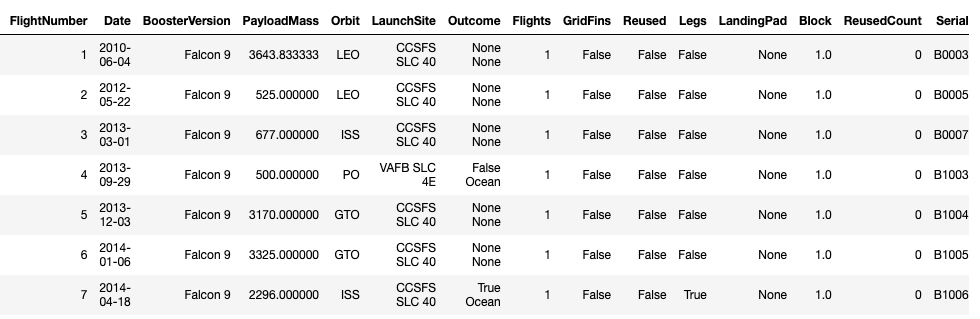

Second, launch data was collected by scraping wiki Space X records from the web using Beautifulsoup. The data was then parsed into a dictionary and then stored in a Pandas DataFrame.

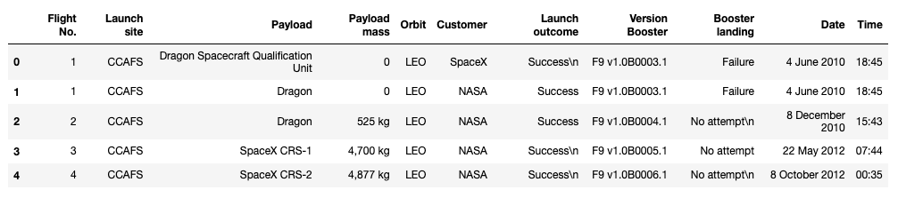

Pie Chart Showing Successful Launches for All Sites

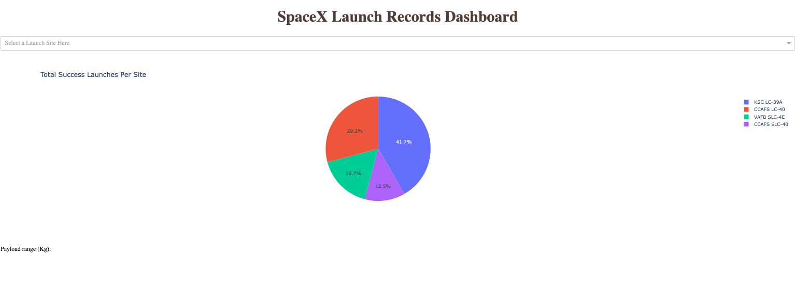

Pie Chart Filtered to Show Just Site SLC-40

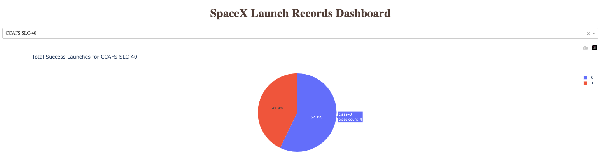

Launch Locations Map View

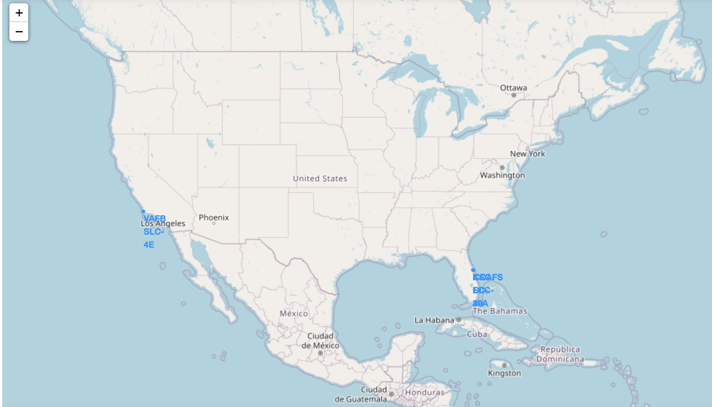

Landing Outcomes Color Coded

Red = Unsuccessful

Green = Successful

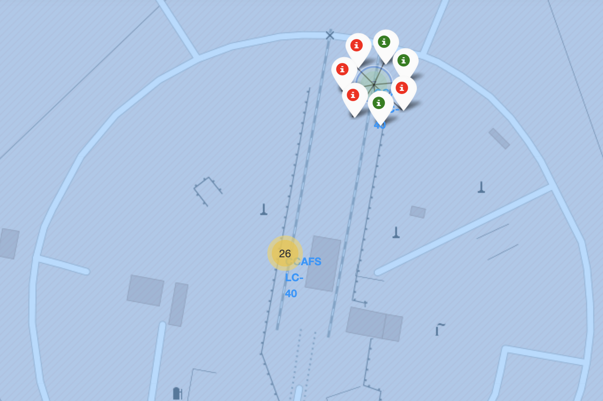

Payload vs Launchsite (O=unsuccessful, 1=Successful)

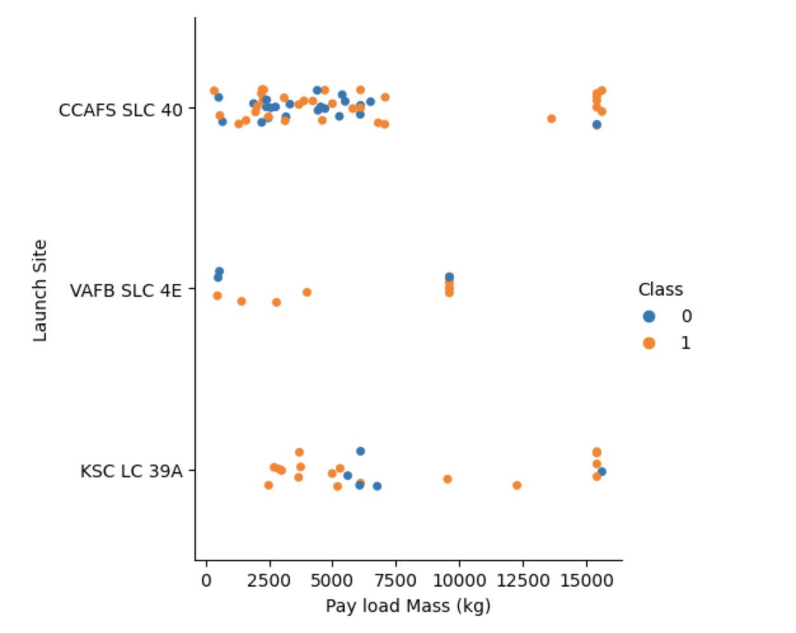

Success Rate Over Time

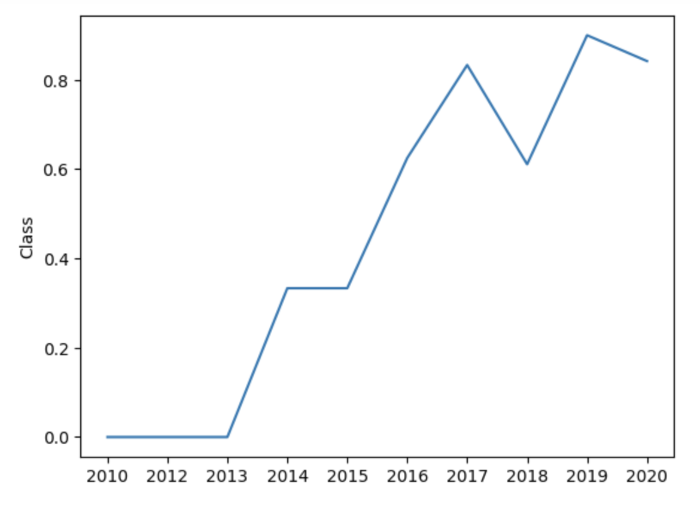

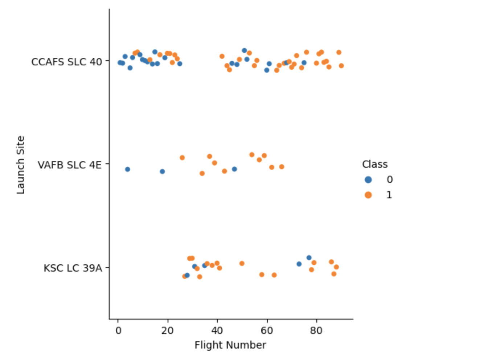

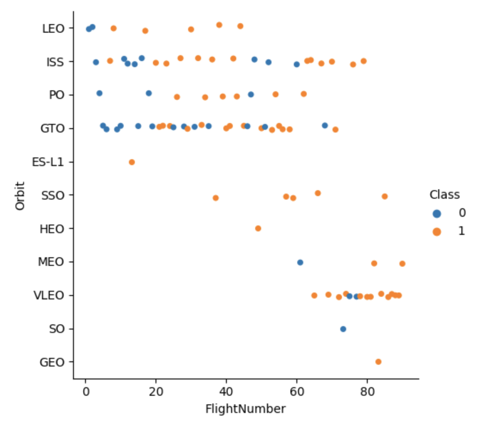

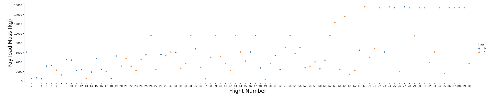
